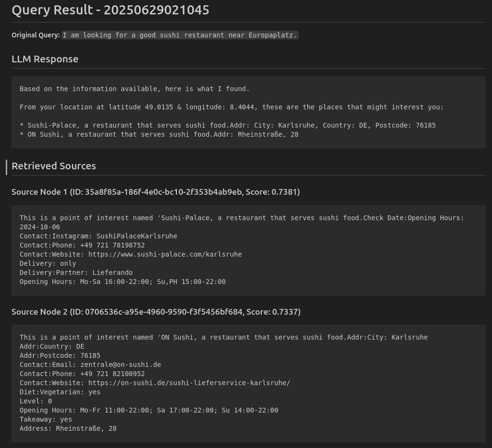
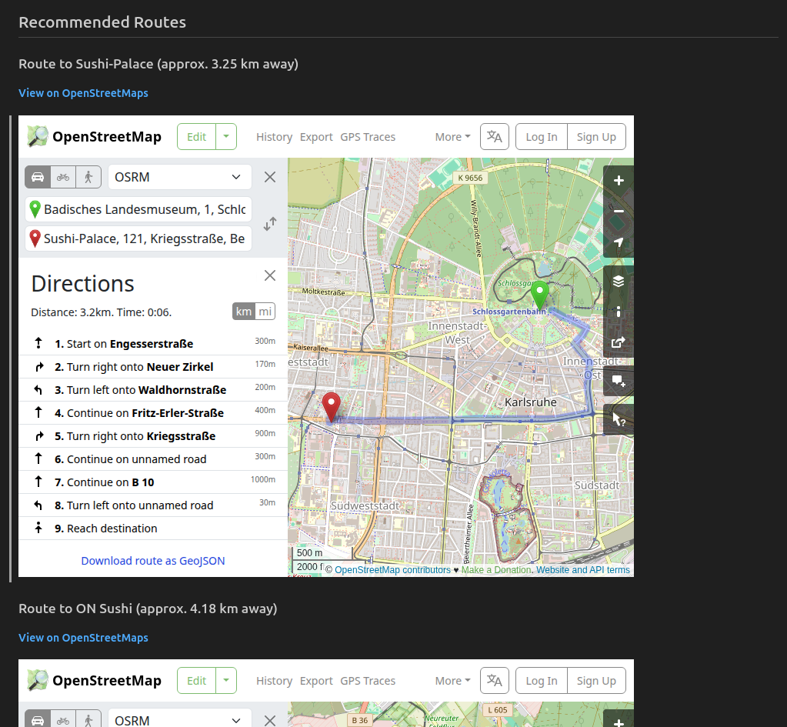

# GeoRAG: A RAG System for Karlsruhe POIs

This project implements a Retrieval-Augmented Generation (RAG) system to recommend points of interest (POIs) in Karlsruhe, Germany, based on user queries.

This project is integrated with LlamaIndex, Milvus, Mistral, Sentence Transformers, Overpass API, & Playwright.

The main features of this project include document ingestion, vector indexing, context retrieval, response generation, & route visualization.

## Setup

1.  **Create a Python Virtual Environment:**

    This project is developed on Python version 3.11
    
    If you are using Venv:

    ```bash
    python -m venv venv
    source venv/bin/activate  # On Windows, use `venv\Scripts\activate`
    ```

    OR if you are using Conda:

    ```bash
    conda create --name venv python=3.11
    conda activate venv
    ```

2.  **Install Dependencies:**

    ```bash
    pip install -r requirements.txt
    ```

3.  **Setup Milvus:**

    This project uses Milvus Lite, an embedded version of Milvus that runs in your Python process. It will automatically be installed as part of the dependencies. Data will be stored in a newly created `milvus_llamaindex.db`.

4. **Setup Ollama**

    If your machine is operating on Linux:

    ```bash
    curl -fsSL https://ollama.com/install.sh | sh
    ```

    For Windows, Ollama have to be installed externally using .exe file from Ollama official website.

5. **Setup language models in Ollama**
    
    This project uses Mistral language model.

    ```bash
    ollama pull mistral
    ```

6. **Setup Playwright**

    Playwright is a screenshot tool which operates on your local machine. It takes screenshot of the page of provided link & saves the image to your local directory.

    ```bash
    playwright install
    ```


## Usage

The system has a command-line interface.

### 1. Ingest Data

First, you need to download data from OpenStreetMap & build the vector index in vector store. This command will fetch data for restaurants, cafes, shops, & tourist attractions in Karlsruhe & store them in Milvus.

```bash
python georag.py ingest
```

This process might take a few minutes, especially the first time you run it, as it needs to download models.

### 2. Query the System

Once the data is ingested, you can ask questions with the following format:

```bash
python georag.py query "I am looking for a good sushi restaurant near Europaplatz"
```

With this command, the system will use default location at Karlsruhe Palace & output a markdown file into the default folder "example_outputs", which contains a response from LLM, the sources it used to generate the answer, link to the map for directions to destination, as well as a screenshot of the map.

If you wish to change your location, you can provide your longitude & latitude with the following command:

```bash
python georag.py query "I am looking for a good sushi restaurant near Europaplatz" --user_lon <YOUR_LONGITUDE> --user_lat <YOUR_LATITUDE>
```

If you wish to change the output directory of the system:

```bash
python georag.py query "I am looking for a good sushi restaurant near Europaplatz" --output_dir <YOUR_DIRECTORY>
```


The output of the generated markdown file should look like this.




### Example Queries

Here are some examples you can try:

*   `python georag.py query "Where can I bring my 2 kids to visit in Karlsruhe?"`
*   `python georag.py query "I want to buy a new washing machine, where can I go?"`
*   `python georag.py query "What are some good places to eat near here?"`
*   `python georag.py query ""Does ON Sushi have vegetarian options?"`

### Demo

For demo purposes, an argument is prepared to initiate all the queries above. Simply input the following into CLI.

```bash
python georag.py example
```

Here, the system is initiated using all default settings such as location at Karlsruhe Palace & default output folder at example_output.


## What's next?

### 1. Real-time route visualization

- **Limitation**: Route visualization currently generates static map images via OpenStreetMap's directions page; it does not integrate with a dynamic routing API for real-time traffic or optimal route calculations.

- **Future enhancement**: Integrate with a dedicated routing API (e.g. OpenRouteService, Google Maps Directions API) for more advanced route planning.


### 2. Full Milvus deployment

- **Limitation**: While Milvus Lite is perfect for local development & testing due to easy initialization & lightweight RAM, it is not designed for high scale concurrent production loads. Managing data of Milvus lite on local file (milvus_llamaindex.db) may also pose difficulties in a production environment.

- **Future enhancement**: Transition to a Milvus Standalone or Milvus Cluster deployment using separate service (e.g. Docker, Kubernetes). Full Milvus deployment also provides full management on data persistence, simplifying data management, backup strategies, & easier scaling.


### 3. Automated user location detection

- **Limitation**: The current system uses default location at Karlsruhe Palace & enables user to manually input location with longitude & latitude values, but is unable to automatically locate user location to provide optimum recommendations.

- **Future enhancement**: Implement automatic user location detection to enhance usability and relevance. This could involve IP geolocation (using a user's IP address to infer their approximate location), browser geolocation API (leveraging the browser's built-in geolocation capabilities), & natural language location extraction (approximates location based on user query, e.g. "near Karlsruhe Palace").