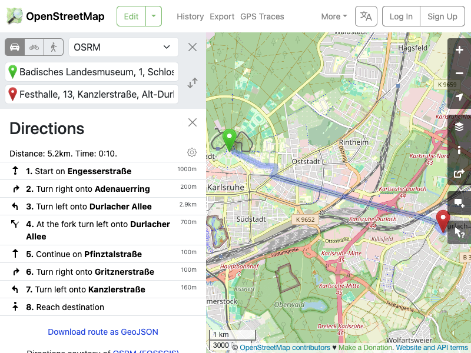
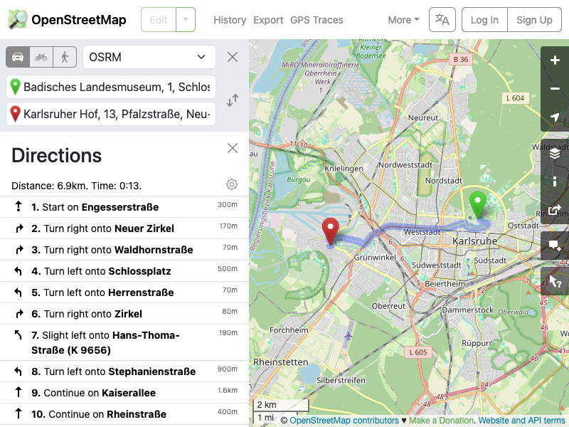

# Query Result - 20250710190358

**Original Query:** `Where can I bring my 2 kids to visit in Karlsruhe?`

## LLM Response

```
 From your location at latitude 49.0135 & longitude 8.4044, these are the places that might interest you for a family visit in Karlsruhe:

1. Karlsruher Hof - A restaurant serving German food with outdoor seating, located at Pfalzstraße, 13. It has limited wheelchair accessibility and no designated parking for parents with children.

'The route to the destination is attached below.'
```

## Retrieved Sources

### Source Node 1 (ID: 46cb9201-187c-4156-b769-c33f0264bee2, Score: 0.6439)
```
This is a point of interest named 'Festhalle, a restaurant.Addr:City: Karlsruhe
Addr:Postcode: 76227
Building: apartments
Building:Levels: 2
Check Date:Opening Hours: 2024-06-15
Indoor Seating: yes
Opening Hours: Mo-Fr 11:30-14:30, Tu-Th 17:00-20:00+
Opening Hours:Signed: no
Outdoor Seating: no
Roof:Levels: 1
Roof:Shape: gabled
Toilets:Wheelchair: no
Wheelchair: yes
Address: Kanzlerstraße, 13
```

### Source Node 2 (ID: 08d28566-fdf4-436f-ac6d-006a5b32791f, Score: 0.6555)
```
This is a point of interest named 'Karlsruher Hof, a restaurant that serves german food.Addr:City: Karlsruhe
Addr:Postcode: 76189
Brewery: Moninger
Outdoor Seating: yes
Toilets:Wheelchair: no
Wheelchair: limited
Address: Pfalzstraße, 13
```

## Recommended Routes

### Route to Festhalle (approx. 5.15 km away)
**[View on OpenStreetMaps](https://www.openstreetmap.org/directions?from=49.0135,8.4044&to=48.9980682,8.4667609)**



### Route to Karlsruher Hof (approx. 6.91 km away)
**[View on OpenStreetMaps](https://www.openstreetmap.org/directions?from=49.0135,8.4044&to=49.0053102,8.3335171)**



