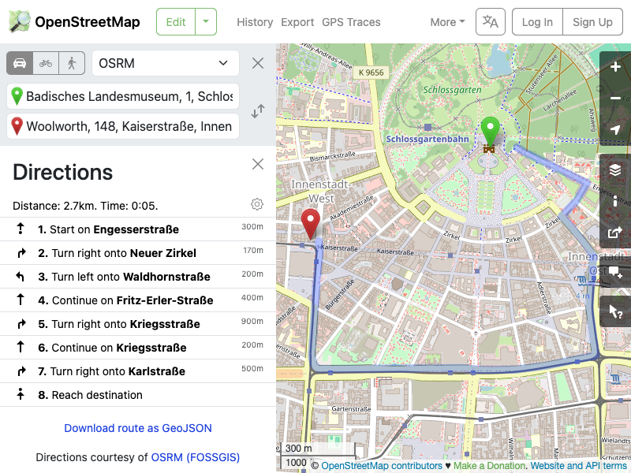
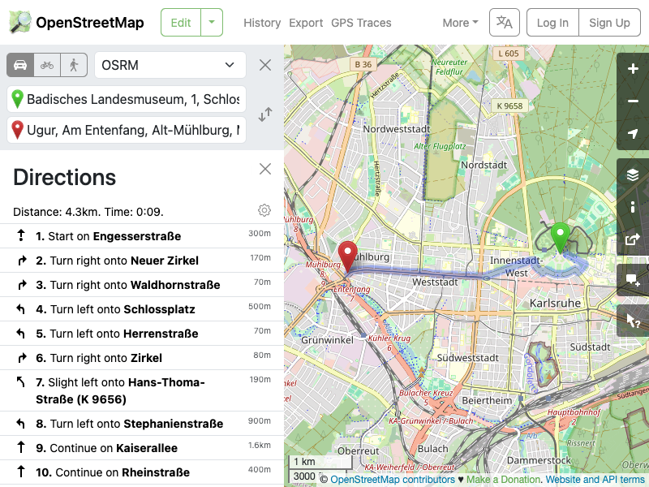

# Query Result - 20250710190451

**Original Query:** `I want to buy a new washing machine, where can I go?`

## LLM Response

```
 From your location at latitude 49.0135 & longitude 8.4044, Woolworth, a department store offering various goods including washing machines, might be the place for you. Its operating hours are from Monday to Saturday, 09:00-20:00 and it is closed on Sundays and public holidays. Please note that it has limited wheelchair access with an elevator available.

The route to Woolworth at Kaiserstraße, 148, Karlsruhe is attached below.

Route to Woolworth:
[Insert Google Maps Direction Link Here]
```

## Retrieved Sources

### Source Node 1 (ID: 3f11e923-7109-49e2-929d-347ceee931e6, Score: 0.4799)
```
This is a point of interest named 'Woolworth, a large store selling many varieties of goods, such as clothing, furniture, home goods, & large appliances like washing machines.Addr:City: Karlsruhe
Addr:Country: DE
Addr:Postcode: 76133
Brand: Woolworth
Brand:Wikidata: Q183538
Brand:Wikipedia: de:Woolworth Deutschland
Check Date:Opening Hours: 2024-11-24
Level: -1
Opening Hours: Mo-Sa 09:00-20:00; Su,PH off
Operator: Woolworth GmbH
Toilets: no
Wheelchair: limited
Wheelchair:Description: Mit Fahrstuhl
Address: Kaiserstraße, 148
```

### Source Node 2 (ID: f8ad577d-a224-4e74-8e6c-787594733c60, Score: 0.4721)
```
This is a point of interest named 'Ugur, a large store selling groceries & household goods like cleaning supplies & personal care items.Level: 0
Opening Hours: Mo-Sa 08:00-20:00; Su,PH off
```

## Recommended Routes

### Route to Woolworth (approx. 2.71 km away)
**[View on OpenStreetMaps](https://www.openstreetmap.org/directions?from=49.0135,8.4044&to=49.0101969,8.3946136)**



### Route to Ugur (approx. 4.31 km away)
**[View on OpenStreetMaps](https://www.openstreetmap.org/directions?from=49.0135,8.4044&to=49.0109896,8.3594022)**



