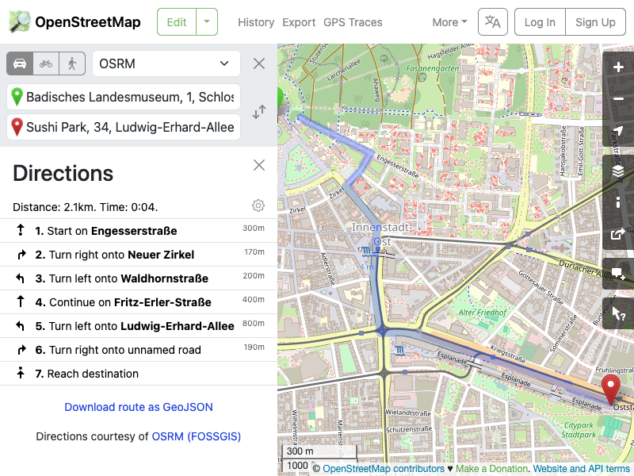
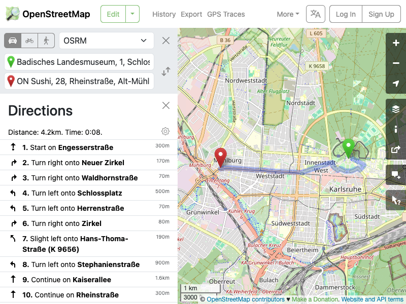

# Query Result - 20250710190644

**Original Query:** `Does ON Sushi have vegetarian options?`

## LLM Response

```
 Based on the information available, ON Sushi does offer vegetarian options. It is open from Monday to Friday between 11:00 AM and 10:00 PM, Saturday from 5:00 PM to 10:00 PM, and Sunday from 2:00 PM to 10:00 PM. The address is Rheinstraße, 28 in Karlsruhe, Germany (Postcode: 76185). To get there, you can find the route attached below.
```

## Retrieved Sources

### Source Node 1 (ID: ada6a13e-2e81-492b-9e1a-44395074e344, Score: 0.6456)
```
This is a point of interest named 'Sushi Park, a restaurant that serves sushi food.Check Date:Opening Hours: 2023-10-09
Contact:Phone: +49 721 66992535
Diet:Vegan: no
Diet:Vegetarian: yes
Email: info@sushi-park.net
Internet Access: wlan
Level: 0
Opening Hours: Mo 17:00-22:00; Tu-Sa 11:30-14:30,17:00-22:00; Su off
Start Date: 2015-10
Wheelchair: yes
Address: Ludwig-Erhard-Allee, 34
```

### Source Node 2 (ID: 97462308-4550-4d90-8ce8-fce84b67ef3a, Score: 0.6676)
```
This is a point of interest named 'ON Sushi, a restaurant that serves sushi food.Addr:City: Karlsruhe
Addr:Country: DE
Addr:Postcode: 76185
Contact:Email: zentrale@on-sushi.de
Contact:Phone: +49 721 82100952
Contact:Website: https://on-sushi.de/sushi-lieferservice-karlsruhe/
Diet:Vegetarian: yes
Level: 0
Opening Hours: Mo-Fr 11:00-22:00; Sa 17:00-22:00; Su 14:00-22:00
Takeaway: yes
Address: Rheinstraße, 28
```

## Recommended Routes

### Route to Sushi Park (approx. 2.08 km away)
**[View on OpenStreetMaps](https://www.openstreetmap.org/directions?from=49.0135,8.4044&to=49.0032801,8.4226593)**



### Route to ON Sushi (approx. 4.18 km away)
**[View on OpenStreetMaps](https://www.openstreetmap.org/directions?from=49.0135,8.4044&to=49.0114852,8.3610409)**



